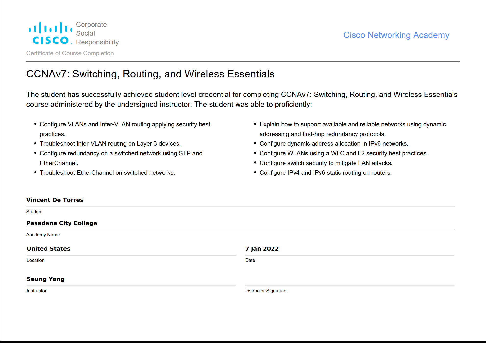

# CCNAv7: Switching, Routing, and Wireless Essentials |  SKILLS DEMO

## Welcome to My CCNAv7 Portfolio!

Dear Employers and CCNA Students,

Thank you for visiting my CCNAv7: Switching, Routing, and Wireless Essentials Showcase repository. Here, I demonstrate my achievements and expertise in networking concepts. This README provides an overview of the repository's contents and how you can explore the demos and lecture materials to get a glimpse of my skills.

## About

This repository serves as a demonstration of my commitment to continuous learning and professional growth in the field of networking. I have successfully completed the CCNAv7 course, gaining valuable knowledge and hands-on experience.

## Demos

The "demos" directory contains practical examples and configurations that showcase my ability to perform specific networking tasks and effectively troubleshoot various scenarios. Feel free to explore the demos to see my skills in action.

List of Demos:

-  [Demo 1: Inter-VLAN Routing](/demos/inter-vlan-routing)
-  [Demo 2: OSPF](/demos/ospf)
-  [Demo 3: EIGRP](/demos/eigrp)
-  [Demo 4: RIPv2](/demos/ripv2)

## Lectures

The "Lectures" directory includes notes, slides, and supplemental documentation related to the major topics covered in the CCNAv7 course. These materials demonstrate my theoretical understanding of networking concepts.

List of Lectures:
- Lecture 2:  VLAN & Inter-VLAN Routing

## Certification

I am proud to have earned my student credential CCNAv7 certification, demonstrating my proficiency in the following areas:

1. VLAN configuration and Inter-VLAN routing with security best practices.
2. Troubleshooting Inter-VLAN routing on Layer 3 devices.
3. Configuring redundancy on a switched network using STP and EtherChannel.
4. Troubleshooting EtherChannel on switched networks.
5. Supporting available and reliable networks using dynamic addressing and first-hop redundancy protocols.
6. Configuring dynamic address allocation in IPv6 networks.
7. Configuring WLANs using a Wireless LAN Controller (WLC) and Layer 2 security best practices.
8. Configuring switch security to mitigate LAN attacks.
9. Configuring IPv4 and IPv6 static routing on routers.

## How to Use This Repository

As an employer or fellow CCNA student, you can explore the "Demos" and "Lectures" directories to gain insight into my networking capabilities. The demos provide hands-on evidence of my skills, while the lectures demonstrate my theoretical understanding.

If you wish to know more about my certification or discuss potential opportunities, please don't hesitate to contact me using the information provided below.

Thank you for considering my CCNAv7 Showcase. I look forward to the possibility of contributing my skills and knowledge to your organization.

## Licensing
The contents of this repository are licensed under the Creative Commons Attribution 4.0 International License (CC BY 4.0). You are free to share and adapt the materials for any purpose, as long as appropriate credit is given to the original author (me).
