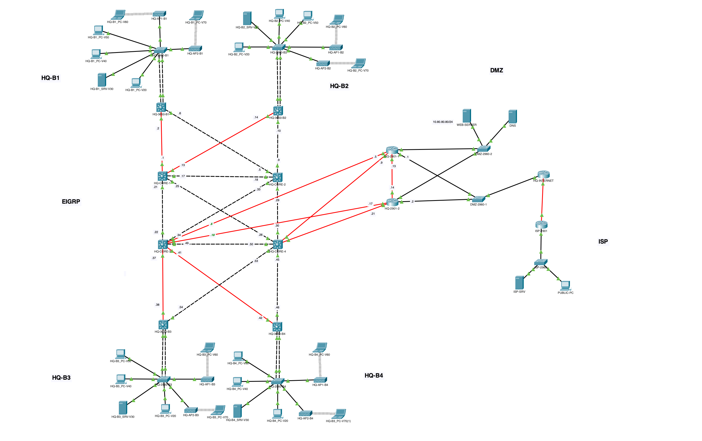

# CCNAv7 II: EIGRP Skills Integration Demonstration


## **Objectives**

In this demonstration, we will configure a scalable and fault-tolerant three-tiered network for four sites: HQ-B1, HQ-B2, HQ-B3, and HQ-B4. The network implementation will involve various technologies such as VTP (VLAN Trunking Protocol), EIGRP (Enhanced Interior Gateway Routing Protocol), inter-VLAN routing, DHCP, HSRP (Hot Standby Router Protocol), NAT (Network Address Translation), and more. Our goal is to establish a comprehensive network setup that supports efficient communication, redundancy, and internet connectivity.


## **Background**

To fulfill the objectives, we will design and configure a network architecture with multiple layers and sites. Each site will consist of a 3650 switch performing inter-VLAN routing and acting as a DHCP server. The network will include VLANs for different purposes: management, server, IT, internal users, WLAN for staff, and WLAN for guests. Additionally, the network will feature a DMZ segment for hosting public-facing servers.


## **Network Topology**



The network will be composed of four main sites: HQ-B1, HQ-B2, HQ-B3, and HQ-B4. Each site will have its own 3650 switch for inter-VLAN routing and DHCP services. The access switches (2960) will connect to the 3650 switches through LACP-configured EtherChannels for redundancy and increased bandwidth. The core switches (Core 1 and Core 2) will provide connectivity between sites.

**Configuration Highlights**:

- Each site (HQ-B1 to HQ-B4) will have a dedicated 3650 switch for inter-VLAN routing and DHCP.
- VLANs: Management (VLAN 20), Server (VLAN 30), IT (VLAN 40), Internal Users (VLAN 50), WLAN Staff (VLAN 60), WLAN Guest (VLAN 70).
- Access switches (2960) will connect to the 3650 switch through LACP EtherChannels.
- VTP will be used for VLAN management, with a dedicated VTP server.
- VLAN 10 will be the native VLAN.
- Access ports for VLANs 20-70 will be configured on the access switches.
- WLANs will have dedicated access points (APs) for staff and guests, with appropriate security settings.
- PCs will be attached to the access switches, obtaining IP addresses through DHCP for most VLANs.
- VLAN 30 (Server) will have a static IP configuration.
- DNS server settings will be configured for specific VLANs.
- Public web servers (www.synapsetechnologies.com and www.internet.com) will be simulated.
- EIGRP will be implemented with ASNs and route summarization for efficient routing.

---

The provided information gives an overview of the objectives, background, and network topology for your CCNAv7 II EIGRP skills integration demonstration. You can now proceed with detailing the configurations, commands, and step-by-step procedures for each component mentioned in your setup.# CCNAv7 II: EIGRP Skills Integration Demonstration

---

## **Objectives**

In this demonstration, we will configure a scalable and fault-tolerant three-tiered network for four sites: HQ-B1, HQ-B2, HQ-B3, and HQ-B4. The network implementation will involve various technologies such as VTP (VLAN Trunking Protocol), EIGRP (Enhanced Interior Gateway Routing Protocol), inter-VLAN routing, DHCP, HSRP (Hot Standby Router Protocol), NAT (Network Address Translation), and more. Our goal is to establish a comprehensive network setup that supports efficient communication, redundancy, and internet connectivity.

---

## **Background**

To fulfill the objectives, we will design and configure a network architecture with multiple layers and sites. Each site will consist of a 3650 switch performing inter-VLAN routing and acting as a DHCP server. The network will include VLANs for different purposes: management, server, IT, internal users, WLAN for staff, and WLAN for guests. Additionally, the network will feature a DMZ segment for hosting public-facing servers.

---

## **Network Topology**

The network will be composed of four main sites: HQ-B1, HQ-B2, HQ-B3, and HQ-B4. Each site will have its own 3650 switch for inter-VLAN routing and DHCP services. The access switches (2960) will connect to the 3650 switches through LACP-configured EtherChannels for redundancy and increased bandwidth. The core switches (Core 1 and Core 2) will provide connectivity between sites.

**Configuration Highlights**:

- Each site (HQ-B1 to HQ-B4) will have a dedicated 3650 switch for inter-VLAN routing and DHCP.
- VLANs: Management (VLAN 20), Server (VLAN 30), IT (VLAN 40), Internal Users (VLAN 50), WLAN Staff (VLAN 60), WLAN Guest (VLAN 70).
- Access switches (2960) will connect to the 3650 switch through LACP EtherChannels.
- VTP will be used for VLAN management, with a dedicated VTP server.
- VLAN 10 will be the native VLAN.
- Access ports for VLANs 20-70 will be configured on the access switches.
- WLANs will have dedicated access points (APs) for staff and guests, with appropriate security settings.
- PCs will be attached to the access switches, obtaining IP addresses through DHCP for most VLANs.
- VLAN 30 (Server) will have a static IP configuration.
- DNS server settings will be configured for specific VLANs.
- Public web servers (www.synapsetechnologies.com and www.internet.com) will be simulated.
- EIGRP will be implemented with ASNs and route summarization for efficient routing.

---
## Addressing

## **IP Addressing and Subnetting**

In this section, we'll delve into the IP addressing and subnetting details for the different components of your network setup.

### **Building IP Address Assignments**

Here's a breakdown of the IP addressing scheme for each building, based on the information provided:

| Building | Network          | Subnet Mask | Default Gateway     | DNS Server       |
|----------|------------------|-------------|---------------------|------------------|
| B1       | 10.1.0.0/16      | 255.255.0.0 | 10.1.0.1            | 10.1.30.100      |
| B2       | 10.2.0.0/16      | 255.255.0.0 | 10.2.0.1            | 10.2.30.100      |
| B3       | 10.3.0.0/16      | 255.255.0.0 | 10.3.0.1            | 10.3.30.100      |
| B4       | 10.4.0.0/16      | 255.255.0.0 | 10.4.0.1            | 10.4.30.100      |
| DMZ      | 10.80.80.0/24    | 255.255.255.0 | -                | -                |

### **P2P Network Assignments**

- For point-to-point (P2P) networks between core switches and 3650 switches within each building will be subnetted from 10.100.0.0/24. I used consecutive /30 for the required number of P2P Networks.
- On the same manner I ssubnetted 10.100.100/24 for P2P Networks needed in HQ-2901-1 & HQ-2901-2 router interfaces.


### **Public IP and Internet Configuration**

| Interface          | IP Address   | Subnet Mask   | Default Gateway |
|--------------------|--------------|---------------|-----------------|
| Public IP          | 212.20.20.128 | 255.255.255.248 | -               |
| Internet IP        | 22.22.22.2   | 255.255.255.252 | -               |
| ISP                | 22.22.22.1   | 255.255.255.252 | -               |

### **Additional Configurations**

For SSH considerations, you'll configure an additional VLAN 10 interface on each 2960 switch:

| Building | VLAN 10 Interface |
|----------|-------------------|
| B1       | 10.1.10.110/24    |
| B2       | 10.2.10.110/24    |
| B3       | 10.3.10.110/24    |
| B4       | 10.4.10.110/24    |

### **HSRP IP Addressing**

For HSRP, the active and standby router's IP addresses will follow the sequence:

- Active Router: X.X.X.130
- Standby Router: X.X.X.131

where X.X.X represents the corresponding network (e.g., 10.1.0.130/24 and 10.1.0.131/24 for B1).

### **Summary**

This IP addressing and subnetting scheme provides clear assignments for each building, P2P networks, public IPs, and additional configurations like HSRP and VLAN 10 interfaces. Ensure that you accurately configure these settings on your devices to establish proper connectivity and routing throughout your network architecture.

## Implementation

### 1. **Configure VTP and VLANs**

#### VTP Server Configuration on HQ-B1:

```CiscoIOS
enable
configure terminal
vtp mode server
vtp domain YOUR_DOMAIN_NAME
vtp password YOUR_VTP_PASSWORD
```

#### VLAN Configuration on HQ-B1:

```CiscoIOS
vlan 10
name Native
vlan 20
name MNGT
...
vlan 70
name WLAN-Guest
```

### 2. **Configure 3650 Switches and EtherChannel**

#### HQ-B1 Configuration:

```CiscoIOS
interface range GigabitEthernet1/0/1-2
channel-group 1 mode active
exit

interface Port-channel1
switchport mode trunk
switchport trunk native vlan 10
switchport trunk allowed vlan 20-70
```

#### HQ-B1 L3 Interface Configuration:

```CiscoIOS
interface Vlan10
ip address 10.10.10.1 255.255.255.0
interface Vlan20
ip address 10.20.20.1 255.255.255.0
...
```

### 3. **Access Switch Configuration**

#### HQ-B1 Access Switch (2960) Configuration:

```CiscoIOS
enable
configure terminal
vtp mode client
interface range FastEthernet0/2-7
switchport mode access
switchport access vlan 20
...
```

### 4. **WLAN Configuration**

#### HQ-B1 WLAN Configuration:

```CiscoIOS
dot11 ssid WLAN-Staff
authentication open
authentication key-management wpa version 2
wpa-psk ascii P@ssw0rd

dot11 ssid WLAN-Guest
authentication open
guest-mode
```

### 5. **DNS Server Configuration**

```CiscoIOS
ip dns server
ip host www.synapsetechnologies.com 10.80.80.80
ip host www.internet.com 80.80.80.80
```

### 6. **EIGRP Configuration**

#### HQ-B1 EIGRP Configuration:

```CiscoIOS
router eigrp 1
network 10.0.0.0
```

### 7. **Configure Firewall Routers**

#### Firewall Router Configuration:

```CiscoIOS
interface GigabitEthernet0/0
ip address 212.20.20.129 255.255.255.248
standby 1 ip 212.20.20.130
standby 1 priority 110
standby 1 preempt

interface GigabitEthernet0/1
ip address 10.10.10.2 255.255.255.0

ip nat inside source static 10.10.10.80 212.20.20.130
ip route 0.0.0.0 0.0.0.0 212.20.20.129
```

### 8. **HSRP Configuration**

```CiscoIOS
interface GigabitEthernet0/1
standby 1 ip 212.20.20.130
standby 1 priority 110
standby 1 preempt
```

### 9. **Floating Static Route Configuration**

```CiscoIOS
ip route 0.0.0.0 0.0.0.0 212.20.20.131
```

### 10. **ISP and Public Servers Configuration**

#### Configure ISP Router:

```CiscoIOS
interface GigabitEthernet0/0
ip address ISP_IP_SUBNET
```

### 11. **EIGRP Configuration for Firewall Routers**

#### Firewall Router EIGRP Configuration:

```CiscoIOS
router eigrp 1
network 212.20.20.128 0.0.0.7
```

This walkthrough provides a high-level overview of the configuration steps for the described network setup. It's important to consult the official documentation for your specific device models and adapt the commands accordingly. Additionally, ensure that you thoroughly test each component to ensure proper functionality and connectivity.

Certainly! Here's the continuation of your README file with the added basic configuration commands for secure device management:


## **Basic Configuration**

After setting up the IP addressing, VLANs, and other network-related configurations, it's essential to implement basic security and management settings on your devices. The following steps outline the basic configurations that should be applied to each network device for enhanced security and streamlined management.

1. **Enable Enhanced Security:**

    ```bash
    enable
    configure terminal
    no ip domain-lookup
    hostname {hostname}
    username admin secret {static_pass}
    ```

    Replace `{hostname}` with the desired hostname for the device and `{static_pass}` with a strong password for the admin user.

2. **Console Line Configuration:**

    ```bash
    line console 0
    logging synchronous
    exit
    ```

3. **Enable SSH and RSA Key Generation:**

    ```bash
    conf t
    ip domain-name {site}.synapsetechnologies.com
    crypto key generate rsa
    1024
    ```

    Specify `{site}` as the name of your site or organization.

4. **Banner and Enable Secret:**

    ```bash
    banner motd ${motd}$
    enable secret {static_pass}
    ```

    Replace `{motd}` with a message of the day and `{static_pass}` with a strong enable secret password.

5. **Console Line Password and Login Configuration:**

    ```bash
    line console 0
    password {static_pass}
    login
    exit
    ```

6. **VTY Line Configuration for SSH:**

    ```bash
    line vty 0 4
    login local
    transport input ssh
    ip ssh version 2
    ```

7. **Password Encryption:**

    ```bash
    service password-encryption
    ```

## **Detailed Configurations**

For detailed configurations of each device in the network, please refer to the individual Markdown files located in the "device-config" directory. Each Markdown file corresponds to a specific device and contains comprehensive step-by-step configuration instructions and commands.

In these configuration files, you will find detailed information on setting up VLANs, inter-VLAN routing, DHCP, access switch configurations, VTP settings, WLAN configurations, EIGRP setup, HSRP configurations, firewall settings, NAT configurations, ISP and public server configurations, and more.

Please navigate to the "device-config" directory to access the specific configuration files for a comprehensive understanding of the network setup and to replicate the demonstration effectively.

Feel free to reach out if you have any questions or require further assistance with any aspect of the network configurations.