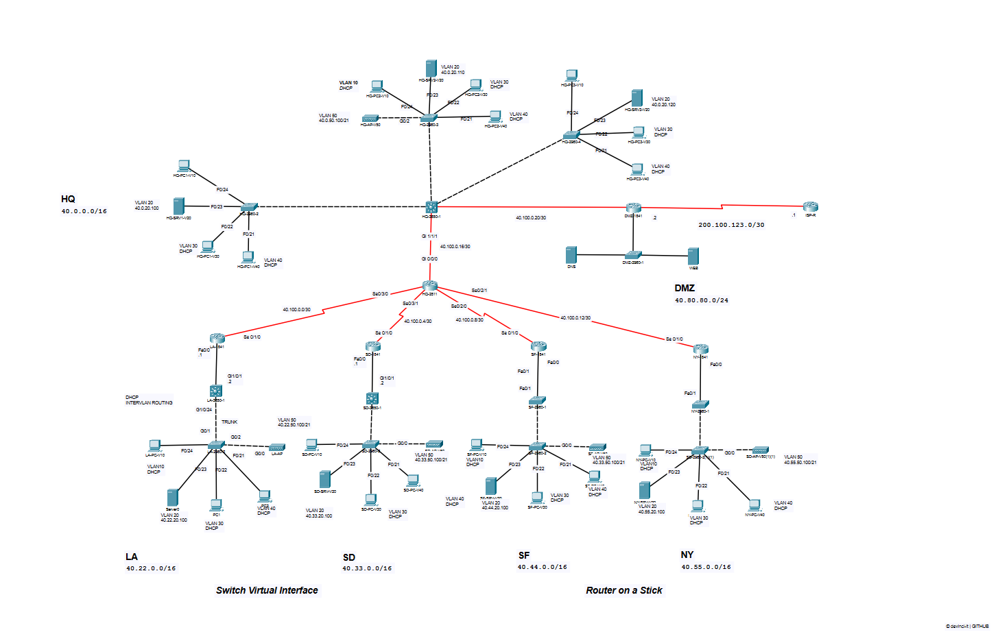

# Inter-VLAN Routing Lab

This repository contains a comprehensive demo setup for a network infrastructure with inter-VLAN routing using Router-on-a-Stick (ROAS) and Switched Virtual Interfaces (SVI). The goal of this lab is to showcase how to configure communication between devices in different VLANs within the network.

## Network Topology

The lab network consists of the following branches, each with its own VLANs:

1. HQ: 40.0.0.0/16
2. LA: 40.22.0.0/16
3. SD: 40.33.0.0/16
4. SF: 40.44.0.0/16
5. NY: 40.55.0.0/16
6. DMZ: 40.80.80.0/24

## VLANs and Subnetting

Each branch location has 5 VLANs, further subnetted as follows:

1. VLAN 10: Management - Subnet: 40.0.10.0/24
2. VLAN 20: Server - Subnet: 40.0.20.0/22
3. VLAN 30: Admin - Subnet: 40.0.30.0/24
4. VLAN 40: Users - Subnet: 40.0.40.0/21
5. VLAN 50: Wireless - Subnet: 40.55.0.0/24

## Basic Configuration for All Devices

Before proceeding with specific configurations for each device, it is essential to apply some common configurations that enhance security and facilitate management across the network. These configurations include setting a hostname, enabling SSH access, implementing encryption, setting passwords, and adding banners. Additionally, developing good habits for network maintenance can improve security and network stability. The following steps will be applied to all devices:

1. **Set the Hostname**:

   ```
   configure terminal
   hostname <DEVICE_HOSTNAME>
   end
   ```

   Replace `<DEVICE_HOSTNAME>` with the appropriate hostname for each device, e.g., LA-2960-2, HQ-3560, NY-1841, etc.

2. **Disable DNS Lookup**:

   ```
   configure terminal
   no ip domain-lookup
   end
   ```

   This prevents the device from attempting to resolve unrecognized commands as hostnames, reducing unnecessary network traffic.

3. **Create a User Account**:

   ```
   configure terminal
   username admin secret cisco
   end
   ```

   This creates a local user account with the username "admin" and the password "cisco" (Note: For production networks, use more secure passwords).

4. **Configure Console Line**:

   ```
   configure terminal
   line console 0
   logging synchronous
   password cisco
   login
   exit
   end
   ```

   Setting a password for the console line and enabling logging synchronization help maintain a clean and organized console interface.

5. **Enable SSH and Generate RSA Key**:

   ```
   configure terminal
   ip domain-name <DOMAIN_NAME>
   crypto key generate rsa modulus 1024
   end
   ```

   Replace `<DOMAIN_NAME>` with the appropriate domain name, e.g., LA.ccna.com. This enables SSH access and generates an RSA key for secure remote management.

6. **Add a Banner**:

   ```
   configure terminal
   banner motd $Welcome to <BRANCH_NAME> branch.$
   end
   ```

   Replace `<BRANCH_NAME>` with the name of the specific branch, e.g., LA, HQ, NY, etc. This displays a welcome message upon login.

7. **Enable Secret Password**:

   ```
   configure terminal
   enable secret cisco
   end
   ```

   This sets the enable secret password to "cisco" (Note: For production networks, use more secure passwords).

8. **Configure VTY Lines for SSH Access**:

   ```
   configure terminal
   line vty 0 4
   login local
   transport input ssh
   end
   ```

   This configures the virtual terminal lines (VTY) to use the local username and enables SSH as the only allowed input method.

9. **Enable Password Encryption**:

   ```
   service password-encryption
   ```

   This encrypts all stored passwords in the configuration file.

**Note**: As a good network maintenance practice, before connecting devices to the network or making any changes to the configuration, it is advisable to shut down all ports and activate only the necessary ports using the `no shutdown` command. This helps prevent unauthorized access and minimizes the risk of any misconfigurations.

By applying these basic configurations and implementing good maintenance habits, you create a more secure and manageable network infrastructure. Remember to customize the configurations according to the specific requirements of each device and branch.

## Inter-VLAN Routing Configuration

### Router-on-a-Stick (ROAS)

1. Connect the router to the Layer 3 switch with a trunk link.

2. Configure the router interface connecting to the switch as a trunk port:

   ```
   conf t
   interface GigabitEthernet0/0
   switchport mode trunk
   switchport trunk allowed vlan all
   end
   ```

3. Create subinterfaces on the router for each VLAN using 802.1Q encapsulation:

   ```
   conf t
   interface GigabitEthernet0/0.10
   encapsulation dot1Q 10
   ip address 40.0.10.1 255.255.255.0
   no shutdown
   exit

   interface GigabitEthernet0/0.20
   encapsulation dot1Q 20
   ip address 40.0.20.1 255.255.252.0
   no shutdown
   exit

   interface GigabitEthernet0/0.30
   encapsulation dot1Q 30
   ip address 40.0.30.1 255.255.255.0
   no shutdown
   exit

   interface GigabitEthernet0/0.40
   encapsulation dot1Q 40
   ip address 40.0.40.1 255.255.248.0
   no shutdown
   exit

   interface GigabitEthernet0/0.50
   encapsulation dot1Q 50
   ip address 40.55.0.1 255.255.255.0
   no shutdown
   exit
   ```

### Switched Virtual Interfaces (SVI)

1. Ensure the Layer 3 switch is connected via trunk links to other switches/routers.

2. Create VLANs on the switch:

   ```
   conf t
   vlan 10
   name Management
   exit

   vlan 20
   name Server
   exit

   vlan 30
   name Admin
   exit

   vlan 40
   name Users
   exit

   vlan 50
   name Wireless
   exit
   ```

3. Configure the SVI for each VLAN with an IP address:

   ```
   interface Vlan10
   ip address 40.0.10.1 255.255.255.0
   no shutdown
   exit

   interface Vlan20
   ip address 40.0.20.1 255.255.252.0
   no shutdown
   exit

   interface Vlan30
   ip address 40.0.30.1 255.255.255.0
   no shutdown
   exit

   interface Vlan40
   ip address 40.0.40.1 255.255.248.0
   no shutdown
   exit

   interface Vlan50
   ip address 40.55.0.1 255.255.255.0
   no shutdown
   exit
   ```

### Enabling IP Routing

Enable IP routing on the Layer 3 switch (HQ, LA, and SD) to allow inter-VLAN communication:

```
conf t
ip routing
end
```

### VTP Configuration

1. Set the appropriate VTP domain for each branch:

   ```
   conf t
   vtp domain HQ
   end

   conf t
   vtp domain LA
   end

   conf t
   vtp domain SD
   end

   conf t
   vtp domain NY
   end

   conf t
   vtp domain SF
   end
   ```

2. Configure each switch as a VTP server or client based on its role:

   ```
   conf t
   vtp mode server
   vtp server version 2
   vtp password <VTP_PASSWORD>
   end

   conf t
   vtp mode client
   vtp server version 2
   vtp password <VTP_PASSWORD>
   end
   ```

### Trunk Configuration

1. Configure trunk links between switches and routers:

   - On switches:

   ```
   conf t
   interface GigabitEthernet0/1
   switchport mode trunk
   switchport trunk allowed vlan all
   end
   ```

   - On routers:

   ```
   conf t
   interface GigabitEthernet0/0
   switchport mode trunk
   switchport trunk allowed vlan all
   end
   ```

### DHCP Configuration

Configure DHCP pools for VLANs 10, 30, 40, and 50 on the DHCP server:

```
conf t
ip dhcp pool VLAN10
network 40.0.10.0 255.255.255.0
default-router 40.0.10.1
dns-server <DNS_SERVER_IP>
exit

ip dhcp pool VLAN30
network 40.0.30.0 255.255.255.0
default-router 40.0.30.1
dns-server <DNS_SERVER_IP>
exit

ip dhcp pool VLAN40
network 40.0.40.0 255.255.248.0
default-router 40.0.40.1
dns-server <DNS_SERVER_IP>
exit

ip dhcp pool VLAN50
network 40.55.0.0 255.255.255.0
default-router 40.55.0.1
dns-server <DNS_SERVER_IP>
exit
```

### Static Routing Configuration

Configure static routes on routers (SF and NY) to reach other branches:

Static Routing Configuration:

To configure static routes on routers (SF and NY) to enable inter-VLAN communication between different branches, follow these general steps:

1. Access the CLI of the router you want to configure.

2. Use the following command to add a static route to a specific destination network via a next-hop IP address:

   ```
   ip route <destination_network> <subnet_mask> <next_hop_ip>
   ```

   Replace `<destination_network>` with the IP address and subnet of the destination network you want to reach, `<subnet_mask>` with the corresponding subnet mask, and `<next_hop_ip>` with the IP address of the next-hop router that will forward traffic to the destination network.

3. Repeat Step 2 for each destination network that requires a static route.


   Ensure that the newly added static routes are listed in the routing table.

Note: When configuring static routes, ensure that the next-hop IP address points to an interface that is reachable from the current router. Verify connectivity between routers before adding static routes to prevent routing loops or incorrect routing behavior.


## Verification

After completing the configuration, verify inter-VLAN communication:

1. Test connectivity between computers within each VLAN.
2. Test connectivity between computers in different VLANs.
3. Verify that computers can ping the SVI/ROAS interfaces and other devices in different VLANs.

## Note

- Complete configuration files for each device are available in the [device-configs](device-configs) folder organized per vtp domain / site.

- For the DHCP configuration, replace `<DNS_SERVER_IP>` with the IP address of your DNS server.

- Regularly monitor DHCP leases and DHCP server availability to ensure smooth network operation.

- Carefully plan and verify static routes to avoid potential routing issues or traffic black-holing.

By configuring inter-VLAN routing, VTP, trunks, DHCP, and static routing, this lab demonstrates an effective and efficient network infrastructure with seamless communication between different VLANs. Properly tested and implemented configurations contribute to a stable and highly functional network. Thank you for participating in this Inter-VLAN Routing Lab! If you have any further questions or need assistance, feel free to ask.