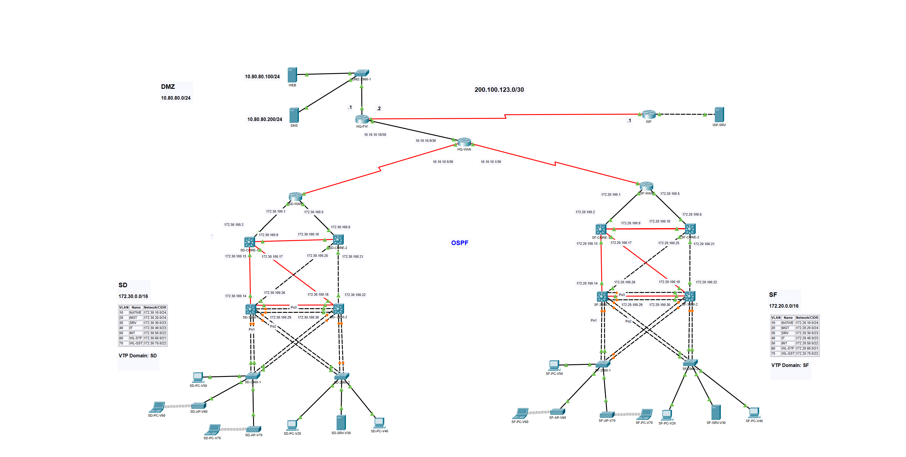

# OSPF Network Project

Welcome to the Multi-Site Network Configuration Project! This project aims to demonstrate various essential networking skills and concepts, providing a robust, scalable, and redundant network infrastructure. Below is an overview of the skills and concepts highlighted throughout the project:

## **Skills & Concepts Demonstrated**

1. **Inter-VLAN Routing:** VLANs are utilized for traffic segmentation, and inter-VLAN routing is enabled to allow communication between different VLANs.

2. **VTP (VLAN Trunking Protocol):** VTP is configured to manage VLAN information across the network, ensuring consistent VLAN configurations at all sites.

3. **VLAN & IP Subnetting:** VLANs are created to divide the network into logical segments, and IP subnetting is applied to allocate IP addresses efficiently.

4. **OSPF (Open Shortest Path First):** OSPF is implemented for dynamic routing, enabling efficient and adaptive path selection for data transmission.

5. **Standby for Inter-VLAN Routing Redundancy:** HSRP (Hot Standby Router Protocol) is employed to provide redundancy for inter-VLAN routing, ensuring uninterrupted communication in case of a router failure.

6. **STP (Spanning Tree Protocol):** STP is used to prevent network loops and provide loop-free logical topologies, enhancing network stability and resiliency.

7. **DHCP (Dynamic Host Configuration Protocol):** DHCP pools are configured to automatically assign IP addresses to devices, streamlining network management.

8. **NAT/PAT (Network Address Translation/Port Address Translation):** NAT is set up to allow internal users to access the internet using a single public IP address, preserving private IP addresses.

9. **Static Routing:** Static routes are established to define specific paths for traffic forwarding, supplementing dynamic routing protocols.

## **Project Configuration**

The project configuration consists of setting up a multi-site network with redundant components and dynamic routing for efficient traffic management. The guide includes step-by-step configurations for each site's Core Layer 3 Switches, Distribution Layer 3 Switches, and Access Layer Switches. The network is divided into VLANs, and inter-VLAN routing is enabled for seamless communication between segments. HSRP provides failover capabilities for inter-VLAN routing. Additionally, OSPF ensures dynamic routing, allowing for optimal data transmission across the network.

To enhance stability and resiliency, STP is configured to prevent network loops, and DHCP pools are created for automatic IP address allocation. Moreover, NAT is set up on the firewall to allow internal users access to the internet while preserving private IP addresses.

By following this project, you will gain practical experience in implementing critical networking skills and concepts, leading to a robust and efficient multi-site network. Feel free to customize the configurations based on your specific requirements and explore further networking possibilities. For any questions or additional assistance, do not hesitate to reach out. Happy networking!