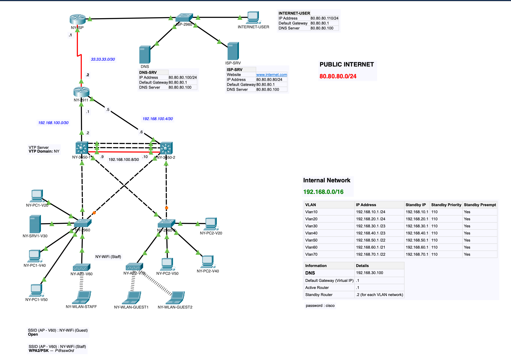

# CCNAv7 II: RIPv2 Skills Integration Demonstration

## Table of Contents

- [Introduction](#introduction)
- [Network Overview](#network-overview)
- [Skills and Technologies Demonstrated](#skills-and-technologies-demonstrated)
- [Network Components](#network-components)
  - [RIPv2 Dynamic Routing](#ripv2-dynamic-routing)
  - [HSRP Redundancy](#hsrp-redundancy)
  - [STP Loop Prevention](#stp-loop-prevention)
  - [NAT and PAT](#nat-and-pat)
  - [DHCP with Helper Address](#dhcp-with-helper-address)
  - [Subnetting](#subnetting)
  - [EtherChannel](#etherchannel)
- [Conclusion](#conclusion)

## Introduction

Welcome to the Comprehensive Network Setup README! This document unveils a sophisticated network configuration that integrates various Cisco skills and cutting-edge networking technologies. From dynamic routing and redundancy to NAT, DHCP, subnetting, and EtherChannel, this network showcases a range of expertise in creating resilient and efficient network architectures.

## Network Overview

This network setup is an embodiment of a complex yet well-organized network environment. It features dynamic routing using RIPv2, redundancy through HSRP, loop prevention with STP, network address translation (NAT) and port address translation (PAT), DHCP services with helper address, subnetting strategies, and the deployment of EtherChannel for link aggregation.

## Skills and Technologies Demonstrated

- **Cisco Networking Expertise:** The network's intricacy demonstrates mastery in Cisco networking devices, configurations, and protocols.

- **Dynamic Routing:** The implementation of RIPv2 reveals skills in configuring dynamic routing protocols for efficient network communication.

- **Redundancy and High Availability:** HSRP showcases the capability to ensure seamless connectivity through redundant gateway solutions.

- **Network Stability:** STP emphasizes expertise in preventing network loops and maintaining network stability.

- **NAT and PAT:** The inclusion of NAT and PAT reflects skills in network address translation, allowing multiple devices to share a single IP address.

- **DHCP with Helper Address:** The DHCP configuration, along with a helper address, underlines skills in automated IP address assignment.

- **Subnetting Strategies:** Subnetting highlights the ability to efficiently allocate IP addresses, enhancing network scalability.

- **EtherChannel Deployment:** EtherChannel demonstrates expertise in bundling multiple physical links to form a single logical link for increased bandwidth.

## Network Components

### RIPv2 Dynamic Routing

RIPv2, or Routing Information Protocol version 2, dynamically exchanges routing information between routers. This allows for automatic route selection based on network changes.

### HSRP Redundancy

The Hot Standby Router Protocol (HSRP) creates a virtual IP address as a default gateway, ensuring high availability in case of router failures.

### STP Loop Prevention

Spanning Tree Protocol (STP) prevents network loops by managing redundant links in the network topology, enhancing network stability.

### NAT and PAT

Network Address Translation (NAT) and Port Address Translation (PAT) enable multiple devices to use a single IP address for external communication, improving address utilization.

### DHCP with Helper Address

The Dynamic Host Configuration Protocol (DHCP) automatically assigns IP addresses to devices, with the helper address facilitating DHCP communication across VLANs.

### Subnetting

Subnetting optimizes IP address allocation by dividing a larger network into smaller, manageable subnetworks, enhancing network organization and scalability.

### EtherChannel

EtherChannel bundles multiple physical links into a logical link, increasing bandwidth and providing redundancy by load-sharing traffic.

## Conclusion

The Comprehensive Network Setup brings to light a wide range of Cisco skills and networking technologies. From dynamic routing and redundancy to NAT, DHCP, subnetting, and EtherChannel, this setup showcases a holistic understanding of creating reliable, scalable, and efficient network architectures. As you explore this network, you'll acquire valuable insights that are applicable to real-world networking scenarios, enriching your networking expertise and problem-solving capabilities.